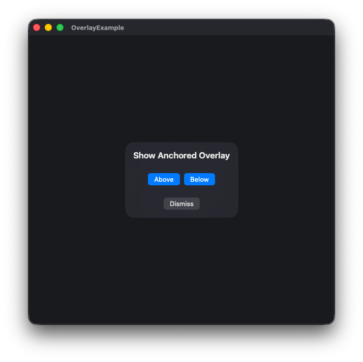
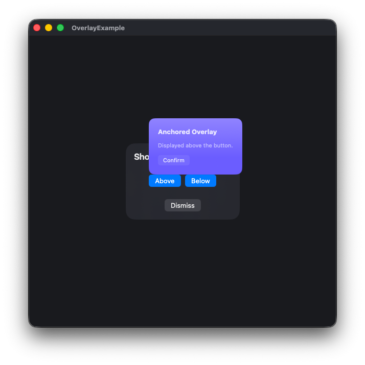

# SimpleOverlaySystem

A lightweight overlay presenter for SwiftUI. It keeps a consistent overlay stack across your view tree using an Observation-powered `EnvironmentValues` entry and supports both centered overlays and anchored overlays attached to controls.

- Platforms: iOS 17+, macOS 14+, Mac Catalyst 17+, tvOS 17+

## Features

- Centered overlays and anchored overlays (shown above/below a source view)
- Flexible dismissal policies: tap outside or programmatic only
- Custom background tap handlers via `.onTapBackground` modifier for conditional dismissal
- Background interaction barrier: block all or passthrough, with optional scrim
- Simple environment integration via optional `@Environment(\.overlayManager)` (guard before use)
- One-time host mounting with `OverlayContainer`

## Installation (Swift Package Manager)

1. Open Xcode, select File > Add Packages.
2. Add the repository URL:
   ```plain
   https://github.com/hot666666/SimpleOverlaySystem.git
   ```

## Quick Start

Wrap your root with `OverlayContainer`. Inside your views, use `@Environment(\.overlayManager)` (an optional value) to present and dismiss overlays. Both centered and anchored overlays are driven by the same manager and you must unwrap before using it.

> Swift 6 enforces that the shared manager be created on the main actor, so the environment entry defaults to `nil` until an `OverlayContainer` injects it. Unwrap (or `guard let`) the manager before calling presentation/dismissal APIs.

```swift
import SwiftUI
import SimpleOverlaySystem

@main
struct OverlayExampleApp: App {
    var body: some Scene {
        WindowGroup {
            OverlayContainer {
                ContentView()
            }
        }
    }
}

struct ContentView: View {
    @Environment(\.overlayManager) private var overlay: OverlayManager?

    var body: some View {
        VStack {
            Button("Show Centered Overlay") {
                overlay?.presentCentered {
                    CenterOverlayView()
                }
            }
        }
    }
}

struct CenterOverlayView: View {
    @Environment(\.overlayManager) private var overlay: OverlayManager?

    var body: some View {
        VStack(spacing: 24) {
            Text("Show Anchored Overlay")
                .font(.title2.weight(.semibold))

            HStack {
                // Above the button, horizontally aligned to the leading edge
                AnchoredOverlayButton(
                    placement: .top(alignment: .leading),
                    dismissPolicy: .actionOnly,
                    barrier: .blockAll
                ) {
                    Text("Above")
                } content: {
                    AnchoredOverlayView()
                }

                // Below the button, horizontally aligned to the trailing edge
                AnchoredOverlayButton(
                    placement: .bottom(alignment: .trailing),
                    dismissPolicy: .actionOnly,
                    barrier: .blockAll
                ) {
                    Text("Below")
                } content: {
                    AnchoredOverlayView()
                }
            }

            Button("Dismiss") {
                overlay?.dismissAll()
            }
        }
        .background(.regularMaterial, in: RoundedRectangle(cornerRadius: 18, style: .continuous))
        .frame(width: 300, height: 200)
    }
}
```

## Usage

### Centered overlays



- Present a modal-like overlay in the center with `presentCentered`.
- Dismiss with `overlay.dismissTop()` or `overlay.dismissAll()`.

```swift
overlay?.presentCentered(
    dismissPolicy: .tapOutside,   // .tapOutside, .actionOnly, .none
    barrier: .blockAll            // .blockAll or .passthrough
) {
    MyCenteredOverlay()
}
```

### Anchored overlays (button-based)



- `AnchoredOverlayButton` anchors the overlay above or below its own frame.
- Horizontal alignment supports `.leading`, `.center`, `.trailing`.

```swift
AnchoredOverlayButton(
    placement: .top(alignment: .center)   // or .leading / .trailing
) {
    Label("Help", systemImage: "questionmark.circle")
} content: {
    DirectionalTipView(title: "Tip", message: "Centered above the button.")
}
```

### Placement options

- `.top(spacing: CGFloat = 0, alignment: .leading | .center | .trailing)`
- `.bottom(spacing: CGFloat = 0, alignment: .leading | .center | .trailing)`

`spacing` sets the vertical gap from the anchor; `alignment` keeps the overlay horizontally aligned to the button’s leading/center/trailing edge. The container clamps the final position to stay within bounds when possible.

## Custom Background Tap Handlers

For scenarios where you need conditional dismissal behavior (e.g., showing a confirmation dialog before dismissing), use the `.onTapBackground` modifier within your overlay view.

### Using `.onTapBackground`

The `.onTapBackground` modifier allows overlay views to intercept background tap gestures and provide custom handling logic based on their internal state.

```swift
struct MyOverlay: View {
    @Environment(\.overlayManager) var manager
    @State private var hasUnsavedChanges = false
    
    var body: some View {
        VStack {
            Toggle("Unsaved Changes", isOn: $hasUnsavedChanges)
            // ... other content
        }
        .padding()
        .background(.regularMaterial)
        .cornerRadius(16)
        .onTapBackground {
            if hasUnsavedChanges {
                // Show confirmation dialog
                manager?.presentCentered(dismissPolicy: .programmatic) {
                    VStack {
                        Text("Discard unsaved changes?")
                        HStack {
                            Button("Discard") {
                                manager?.dismissAll()
                            }
                            Button("Cancel") {
                                manager?.dismissTop()
                            }
                        }
                    }
                    .padding()
                    .background(.regularMaterial)
                    .cornerRadius(16)
                }
            } else {
                manager?.dismissTop()
            }
        }
    }
}

// Present the overlay with tap-to-dismiss policy
overlay?.presentCentered(dismissPolicy: .tap) {
    MyOverlay()
}
```

> **Note**: The `.onTapBackground` modifier only works when the overlay's `dismissPolicy` is set to `.tap`. For `.programmatic` overlays, background taps are ignored regardless of the modifier.

## API Summary

- `OverlayContainer`: Owns an `OverlayManager` and mounts the host automatically
- `@Environment(\.overlayManager)`: Optional environment hook (unwrap before presenting)
- `presentCentered(...)`: Show a centered overlay
- `AnchoredOverlayButton(...)`: Show an overlay anchored to the triggering button
- `dismissTop()`, `dismiss(id:)`, `dismissAll()`: Remove overlays from the stack
- `DismissPolicy`: `.programmatic` or `.tap`
- `OverlayInteractionBarrier`: `.blockAll`, `.passthrough`
- `.onTapBackground(perform:)`: Modifier to intercept background taps and provide custom dismissal logic

## License

This project is licensed under the MIT License. See [LICENSE](LICENSE) for details.
