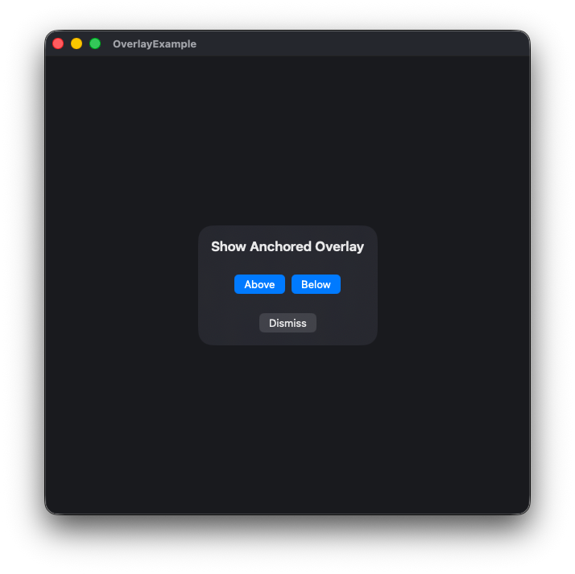
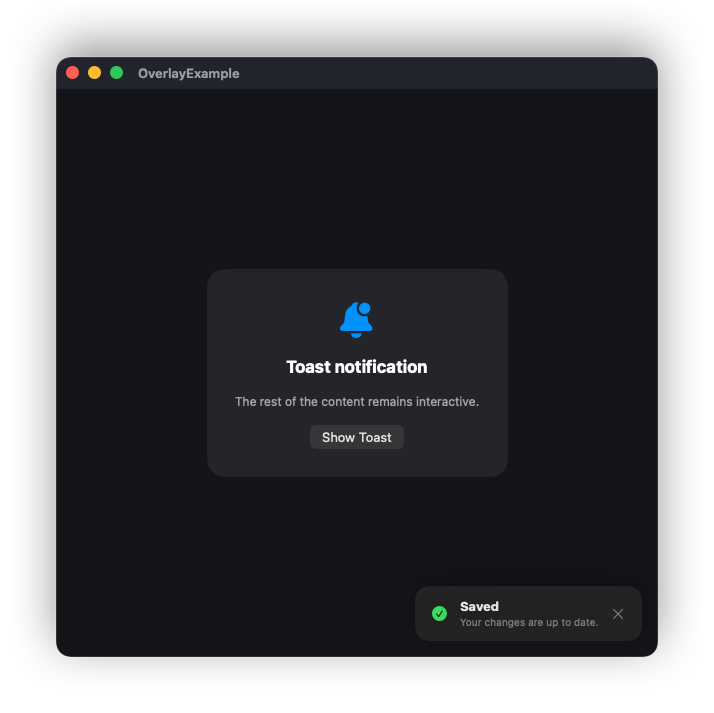
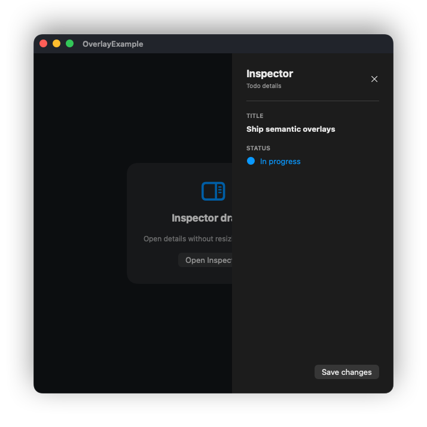
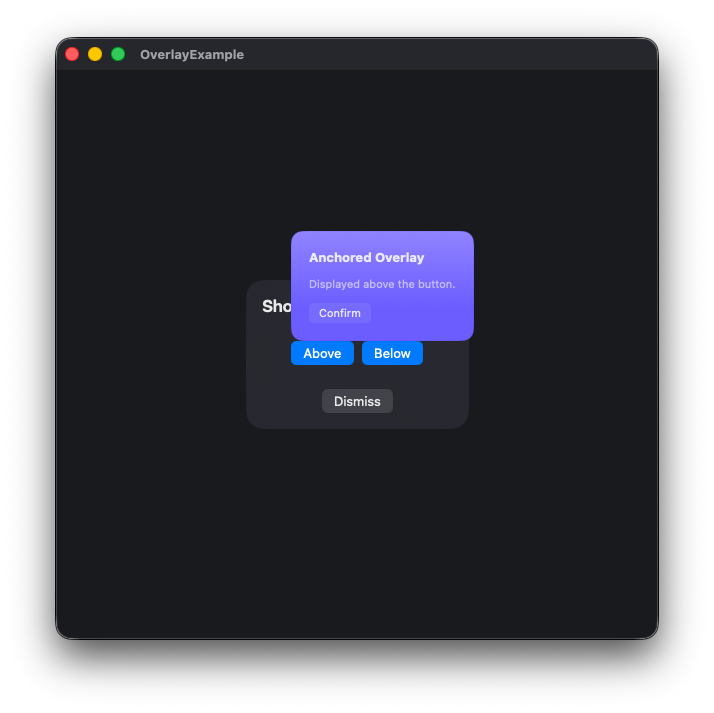

# SimpleOverlaySystem

A lightweight overlay presenter for SwiftUI. It keeps a consistent overlay stack across your view tree using an Observation-powered `EnvironmentValues` entry and supports centered, anchored, toast, and drawer presentations.

- Platforms: iOS 17+, macOS 14+

## Features

- Centered overlays and anchored overlays (shown above/below a source view)
- Semantic edge toasts with automatic dismissal and deterministic stacking
- Leading, trailing, and bottom drawers constrained to the existing host bounds
- Manager-based and Binding-based presentation APIs backed by one host
- **Overlay identifier** for controlling duplicate overlays (unique, replacing, auto)
- Flexible dismissal policies: tap outside or programmatic only
- Custom background tap handlers via `.onTapBackground` modifier for conditional dismissal
- Background interaction barrier: block all or passthrough, with optional scrim
- Simple environment integration via optional `@Environment(\.overlayManager)` (guard before use)
- One-time host mounting with `OverlayContainer`

## Installation (Swift Package Manager)

1. Open Xcode, select File > Add Packages.
2. Add the repository URL:
   ```plain
   https://github.com/hot666666/SimpleOverlaySystem.git
   ```

## Quick Start

Wrap your root with `OverlayContainer`. Inside your views, use `@Environment(\.overlayManager)` (an optional value) to present and dismiss overlays. Both centered and anchored overlays are driven by the same manager and you must unwrap before using it.

> Swift 6 enforces that the shared manager be created on the main actor, so the environment entry defaults to `nil` until an `OverlayContainer` injects it. Unwrap (or `guard let`) the manager before calling presentation/dismissal APIs.

```swift
import SwiftUI
import SimpleOverlaySystem

@main
struct OverlayExampleApp: App {
    var body: some Scene {
        WindowGroup {
            OverlayContainer {
                ContentView()
            }
        }
    }
}

struct ContentView: View {
    @Environment(\.overlayManager) private var overlay: OverlayManager?

    var body: some View {
        VStack {
            Button("Show Centered Overlay") {
                overlay?.presentCentered {
                    CenterOverlayView()
                }
            }
        }
    }
}

struct CenterOverlayView: View {
    @Environment(\.overlayManager) private var overlay: OverlayManager?

    var body: some View {
        VStack(spacing: 24) {
            Text("Show Anchored Overlay")
                .font(.title2.weight(.semibold))

            HStack {
                // Above the button, horizontally aligned to the leading edge
                AnchoredOverlayButton(
                    placement: .top(alignment: .leading),
                    dismissPolicy: .programmatic,
                    barrier: .blockAll
                ) {
                    Text("Above")
                } content: {
                    AnchoredOverlayView()
                }

                // Below the button, horizontally aligned to the trailing edge
                AnchoredOverlayButton(
                    placement: .bottom(alignment: .trailing),
                    dismissPolicy: .programmatic,
                    barrier: .blockAll
                ) {
                    Text("Below")
                } content: {
                    AnchoredOverlayView()
                }
            }

            Button("Dismiss") {
                overlay?.dismissAll()
            }
        }
        .background(.regularMaterial, in: RoundedRectangle(cornerRadius: 18, style: .continuous))
        .frame(width: 300, height: 200)
    }
}
```

## Usage

### Centered overlays



- Present a modal-like overlay in the center with `presentCentered`.
- Dismiss with `overlay.dismissTop()` or `overlay.dismissAll()`.

```swift
overlay?.presentCentered(
    dismissPolicy: .tap,          // .tap or .programmatic
    barrier: .blockAll            // .blockAll or .passthrough
) {
    MyCenteredOverlay()
}
```

### Toasts



Use the manager when a toast represents an event. The toast itself can contain buttons, while the rest of the host remains interactive.

```swift
overlay?.present(
    .toast(
        edge: .bottom,
        alignment: .end,
        duration: .automatic
    ),
    id: .replacing("saved")
) {
    SavedToast()
}
```

- `.automatic` dismisses after three seconds.
- `.seconds(_:)` supplies a custom lifetime.
- `.persistent` requires explicit dismissal.
- The newest toast stays closest to its edge.
- Each edge shows at most three toasts by default. If the measured content does
  not fit the available safe-area lane, the host keeps the newest toasts that
  fit without overlap and removes older overflow.

### Drawers



Drawers own their modal interaction policy. The call site does not configure raw barriers, offsets, focus rules, or transitions.

```swift
overlay?.present(
    .drawer(edge: .trailing, extent: .inspector),
    id: .replacing("todo-inspector")
) {
    TodoInspector()
}
```

`DrawerExtent` describes the axis perpendicular to the edge: width for leading/trailing drawers and height for bottom drawers.

- `.content(max:)`
- `.fixed(_:)`
- `.fraction(_:)`
- `.inspector` (`.content(max: 360)`)

Drawers remain inside `OverlayContainer`; they never resize an `NSWindow` or another platform window.

### Binding-based presentation

Use a Binding when SwiftUI state owns the presentation lifecycle.

```swift
ContentView()
    .overlayDrawer(
        item: $selectedTodo,
        edge: .trailing,
        extent: .inspector
    ) { todo in
        TodoInspector(todo: todo)
    }
```

Available Binding modifiers:

- `.overlayCentered(isPresented:/item:)`
- `.overlayAnchored(isPresented:/item:placement:)`
- `.overlayToast(isPresented:/item:edge:)`
- `.overlayDrawer(isPresented:/item:edge:extent:)`

Changing one non-nil drawer item to another updates content in place without replaying the drawer transition. Changing a toast item restarts its lifetime as a new notification.

### Dismissing from overlay content

Overlay content can dismiss its own presentation without keeping an `OverlayID`.

```swift
struct InspectorView: View {
    @Environment(\.dismissOverlay) private var dismissOverlay

    var body: some View {
        Button("Close") { dismissOverlay() }
    }
}
```

Intercept backdrop, Escape, and accessibility dismissal through one callback:

```swift
InspectorView()
    .onOverlayDismissRequest {
        if hasUnsavedChanges {
            showDiscardConfirmation = true
        } else {
            dismissOverlay()
        }
    }
```

The existing `.onTapBackground` modifier remains available for backdrop-only legacy behavior.

### Anchored overlays (button-based)



- `AnchoredOverlayButton` anchors the overlay above or below its own frame.
- Horizontal alignment supports `.leading`, `.center`, `.trailing`.

```swift
AnchoredOverlayButton(
    placement: .top(alignment: .center)   // or .leading / .trailing
) {
    Label("Help", systemImage: "questionmark.circle")
} content: {
    DirectionalTipView(title: "Tip", message: "Centered above the button.")
}
```

### Placement options

- `.top(spacing: CGFloat = 0, alignment: .leading | .center | .trailing)`
- `.bottom(spacing: CGFloat = 0, alignment: .leading | .center | .trailing)`

`spacing` sets the vertical gap from the anchor; `alignment` keeps the overlay horizontally aligned to the button’s leading/center/trailing edge. The container clamps the final position to stay within bounds when possible.

## Custom Background Tap Handlers

For scenarios where you need conditional dismissal behavior (e.g., showing a confirmation dialog before dismissing), use the `.onTapBackground` modifier within your overlay view.

### Using `.onTapBackground`

The `.onTapBackground` modifier allows overlay views to intercept background tap gestures and provide custom handling logic based on their internal state.

```swift
struct MyOverlay: View {
    @Environment(\.overlayManager) var manager
    @State private var hasUnsavedChanges = false
    
    var body: some View {
        VStack {
            Toggle("Unsaved Changes", isOn: $hasUnsavedChanges)
            // ... other content
        }
        .padding()
        .background(.regularMaterial)
        .cornerRadius(16)
        .onTapBackground {
            if hasUnsavedChanges {
                // Show confirmation dialog
                manager?.presentCentered(dismissPolicy: .programmatic) {
                    VStack {
                        Text("Discard unsaved changes?")
                        HStack {
                            Button("Discard") {
                                manager?.dismissAll()
                            }
                            Button("Cancel") {
                                manager?.dismissTop()
                            }
                        }
                    }
                    .padding()
                    .background(.regularMaterial)
                    .cornerRadius(16)
                }
            } else {
                manager?.dismissTop()
            }
        }
    }
}

// Present the overlay with tap-to-dismiss policy
overlay?.presentCentered(dismissPolicy: .tap) {
    MyOverlay()
}
```

> **Note**: The `.onTapBackground` modifier only works when the overlay's `dismissPolicy` is set to `.tap`. For `.programmatic` overlays, background taps are ignored regardless of the modifier.

## Overlay Identifier (Duplicate Control)

Control whether an overlay can be presented multiple times or should remain unique.

### Available Policies

- **`.auto`** (default): Generates a new ID each time. Multiple overlays allowed.
- **`.unique("key")`**: Ignores new presentations if an overlay with the same key exists.
- **`.replacing("key")`**: Dismisses the existing overlay and presents a new one.

### Usage

```swift
// Default auto behavior - allows duplicates
overlay?.presentCentered { ToastView() }

// Unique - ignores if already presented
overlay?.presentCentered(id: .unique("settings")) {
    SettingsSheet()
}

// Replacing - dismisses existing and presents new
overlay?.presentCentered(id: .replacing("alert")) {
    AlertView()
}
```

### Extending for Convenience

Define static members in your app for cleaner call sites:

```swift
extension OverlayIdentifier {
    static var settings: Self { .unique("settings") }
    static var todoSheet: Self { .unique("todoSheet") }
}

// Usage
overlay?.presentCentered(id: .settings) { SettingsSheet() }
```

### Query and Dismiss by Key

```swift
// Check if an overlay with a specific key is presented
if overlay?.contains(key: "settings") == true {
    // ...
}

// Dismiss overlays with a specific key
overlay?.dismiss(key: "settings")
```

## API Summary

- `OverlayContainer`: Owns an `OverlayManager` and mounts the host automatically
- `@Environment(\.overlayManager)`: Optional environment hook (unwrap before presenting)
- `presentCentered(id:...)`: Show a centered overlay with optional identifier
- `presentAnchored(id:...)`: Show an anchored overlay with optional identifier
- `present(_:id:content:)`: Show a semantic toast or drawer
- `AnchoredOverlayButton(...)`: Show an overlay anchored to the triggering button
- `.overlayCentered`, `.overlayAnchored`, `.overlayToast`, `.overlayDrawer`: Binding presentation modifiers
- `dismissTop()`, `dismiss(id:)`, `dismiss(key:)`, `dismissAll()`: Remove overlays from the stack
- `@Environment(\.dismissOverlay)`: Dismiss the containing overlay
- `contains(key:)`: Check if an overlay with the specified key is presented
- `OverlayIdentifier`: `.auto`, `.unique("key")`, `.replacing("key")`
- `DismissPolicy`: `.programmatic` or `.tap`
- `OverlayInteractionBarrier`: `.blockAll`, `.passthrough`
- `.onTapBackground(perform:)`: Modifier to intercept background taps and provide custom dismissal logic
- `.onOverlayDismissRequest(perform:)`: Unified drawer dismissal interception

## Validation

CI covers checks that are deterministic on a headless GitHub runner:

```sh
swift test
swift format lint --recursive Sources Tests
swift package generate-documentation --target SimpleOverlaySystem
```

The CI workflow also cross-builds the package for iOS 17. The macOS test build
compiles the package and exercises manager, Binding, layout, timer, dismiss
handler freshness, and measured SwiftUI Host geometry behavior.

Window focus and event routing depend on an interactive macOS login session.
Run the full local suite when changing hit testing, backdrop interaction, focus,
Escape handling, or dismissal interception:

```sh
SIMPLE_OVERLAY_RUN_WINDOW_TESTS=1 swift test
```

Without that environment variable, the four AppKit key-window interaction
tests are skipped explicitly; they are never reported as CI coverage.

## License

This project is licensed under the MIT License. See [LICENSE](LICENSE) for details.
